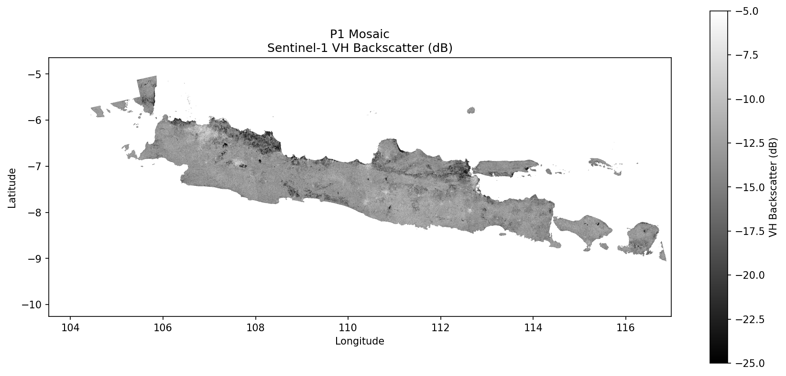
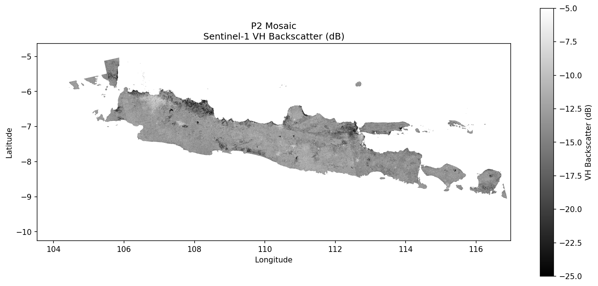
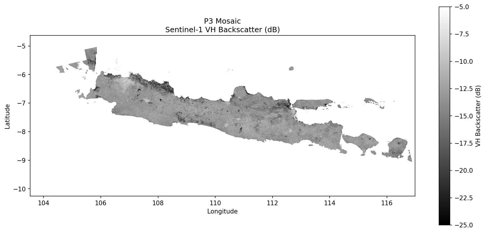
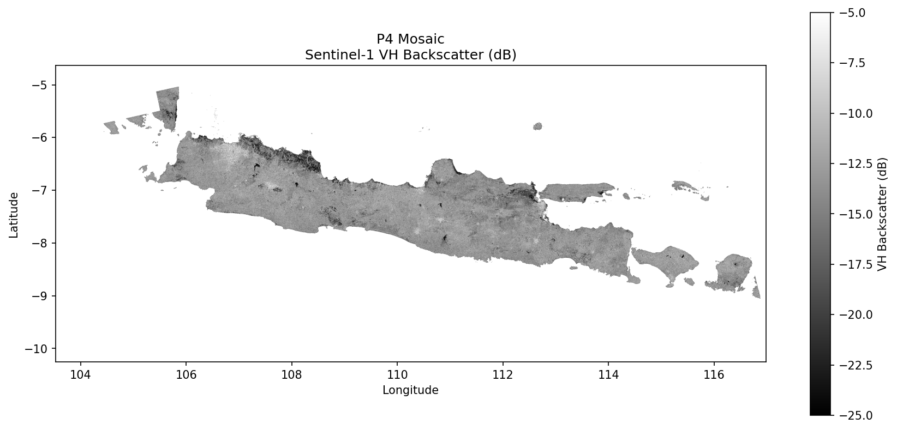

# Sentinel-1 SAR Preprocessing Pipeline

[](https://opensource.org/licenses/MIT)
[](https://www.python.org/downloads/)
[](https://step.esa.int/main/download/snap-download/)
[](https://github.com/firmanhadi21/s1-preprocessing-pipeline/stargazers)
[](https://github.com/firmanhadi21/s1-preprocessing-pipeline/issues)

Simple, proven workflow for preprocessing Sentinel-1 GRD data using ESA SNAP.

## Why SNAP Instead of Google Earth Engine?

Many users prefer Google Earth Engine (GEE) for Sentinel-1 processing because it's fast and convenient. However, there are important reasons to use ESA SNAP instead:

### 1. Complete Processing Chain

GEE's Sentinel-1 preprocessing is **incomplete**. According to [Google's official documentation](https://developers.google.com/earth-engine/datasets/catalog/COPERNICUS_S1_GRD), GEE only applies: thermal noise removal, radiometric calibration, and terrain correction. Critical steps are missing:

| Processing Step | SNAP | GEE | Impact |
|-----------------|:----:|:---:|--------|
| Apply Orbit File | ✅ | ✅ | Geometric accuracy |
| Thermal Noise Removal | ✅ | ✅ | Reduce noise floor |
| Radiometric Calibration | ✅ | ✅ | Physical units (σ⁰, β⁰, γ⁰) |
| **Terrain Flattening** | ✅ | ❌ | **Corrects slope-induced radiometric distortions** |
| Terrain Correction | ✅ | ✅ | Geometric correction |
| Speckle Filtering | ✅ | ❌ | Reduce SAR speckle noise |
| Border Noise Removal | ✅ | ⚠️ | Remove edge artifacts |

#### Why Terrain Flattening Matters

**Terrain Flattening** (radiometric terrain normalization) is essential for accurate backscatter analysis:

- Without it, backscatter values on slopes are **biased by local incidence angle**, not actual surface properties
- Forested hillsides facing the sensor appear brighter than those facing away
- Agricultural fields on slopes show artificial variation unrelated to crop conditions
- This bias **cannot be corrected after terrain correction** - it must be done before

This is why researchers developed additional frameworks like [gee_s1_ard](https://github.com/adugnag/gee_s1_ard) to add radiometric terrain normalization to GEE - but it's complex and computationally expensive in GEE.

**With SNAP, terrain flattening is a standard step** in the processing chain.

### 2. Commercial Use & Licensing

GEE has licensing restrictions:
- GEE is **free only for research, education, and non-profit use**
- **Commercial applications require a paid Google Earth Engine license**
- Using GEE-processed data in commercial products may violate terms of service

With SNAP:
- ESA SNAP is **free and open-source** (GPL-3.0)
- Sentinel-1 data is **free and open** under Copernicus license
- **No restrictions** on commercial use of your processed outputs

### 3. Independence & Reproducibility

- **No vendor lock-in**: Your workflow doesn't depend on Google's cloud service
- **Offline processing**: Works without internet after downloading data
- **Full control**: Complete transparency over every processing step
- **Long-term reproducibility**: Not affected by GEE API changes or service availability

## Workflow

1. **Search** Sentinel-1 scenes on [ASF Vertex](https://search.asf.alaska.edu/)
2. **Download** the .zip files to a `downloads/` folder
3. **Run** the preprocessing script

## Quick Start

```bash
# Create period folder structure
mkdir -p p15/downloads

# Download Sentinel-1 GRD .zip files from ASF into p15/downloads/

# Run preprocessing (from inside the period folder)
cd p15
python /path/to/s1_process_period_dir.py --run-all
```

## Output Structure

```
p15/
├── downloads/      # Input: Place .zip files here
├── preprocessed/   # SNAP output (.dim files)
├── geotiff/        # Converted GeoTIFF files
└── mosaic/         # Final mosaic + preview image
    ├── p15_mosaic.tif
    └── p15_preview.png
```

## Sample Output

Sentinel-1 VH backscatter mosaics over Java Island, Indonesia (20m resolution):

| Period 1 (Jan 1-12) | Period 2 (Jan 13-24) |
|:---:|:---:|
|  |  |

| Period 3 (Jan 25 - Feb 5) | Period 4 (Feb 6-17) |
|:---:|:---:|
|  |  |

## Resolution Options

```bash
# 20m resolution (default, recommended)
python s1_process_period_dir.py --run-all

# 10m resolution (highest detail, slower)
python s1_process_period_dir.py --run-all --resolution 10

# 50m resolution (faster processing)
python s1_process_period_dir.py --run-all --resolution 50

# 100m resolution (quickest, for previews)
python s1_process_period_dir.py --run-all --resolution 100
```

## Individual Steps

```bash
# Step 1: Preprocess with SNAP
python s1_process_period_dir.py --preprocess

# Step 2: Convert .dim to GeoTIFF
python s1_process_period_dir.py --convert

# Step 3: Mosaic all scenes
python s1_process_period_dir.py --mosaic

# Step 4: Create preview image
python s1_process_period_dir.py --preview
```

## Automatic Pipeline (EXPERIMENTAL)

> ⚠️ **WARNING**: This feature is **EXPERIMENTAL** and has **NOT been fully tested**. Use at your own risk. For production use, we recommend the manual workflow above.

For users who want a fully automated experience, we provide `s1_auto_pipeline.py` that handles everything from download to mosaic:

```bash
# Install additional dependencies
pip install asf-search shapely

# Run automatic pipeline
python s1_auto_pipeline.py \
    --bbox 110.0 -7.5 111.0 -6.5 \
    --start-date 2024-01-01 \
    --end-date 2024-01-12 \
    --output-dir ./my_output
```

### Parameters

| Parameter | Description | Example |
|-----------|-------------|---------|
| `--bbox` | Bounding box (min_lon min_lat max_lon max_lat) | `110.0 -7.5 111.0 -6.5` |
| `--start-date` | Start date (YYYY-MM-DD) | `2024-01-01` |
| `--end-date` | End date (YYYY-MM-DD) | `2024-01-12` |
| `--output-dir` | Output directory | `./my_output` |
| `--resolution` | Resolution in meters (10, 20, 50, 100) | `20` |
| `--max-scenes` | Maximum scenes to download | `50` |

### Known Limitations

- ❌ ASF download may fail for some regions or time periods
- ❌ Large areas may exceed memory limits
- ❌ Network interruptions can cause incomplete downloads
- ❌ Some Sentinel-1 scenes may have missing data
- ❌ No authentication support for restricted datasets

### When to Use Manual vs Automatic

| Use Case | Recommendation |
|----------|----------------|
| Production / operational use | **Manual workflow** |
| Quality-critical applications | **Manual workflow** |
| Learning / experimentation | Automatic pipeline |
| Quick preview of an area | Automatic pipeline |
| Large area processing | **Manual workflow** |

## Processing Chain

The SNAP preprocessing applies:
1. Apply Orbit File (precise orbit correction)
2. Thermal Noise Removal
3. Calibration (Beta0)
4. Terrain Flattening
5. Terrain Correction (Range Doppler)
6. Speckle Filtering (Gamma MAP 5x5)
7. Linear to dB conversion

## Requirements

- **Python 3.8+** with `rasterio`, `numpy`, `matplotlib`
- **ESA SNAP 10.0+** with Sentinel-1 Toolbox
- **GDAL** with `gdal_merge.py`

---

## Installation Guide

### Step 1: Install Python Dependencies

```bash
pip install rasterio numpy matplotlib
```

For the automatic pipeline (optional):
```bash
pip install asf-search shapely
```

### Step 2: Install GDAL

<details>
<summary><b>Linux (Ubuntu/Debian)</b></summary>

```bash
sudo apt update
sudo apt install gdal-bin python3-gdal
```
</details>

<details>
<summary><b>macOS</b></summary>

```bash
brew install gdal
```
</details>

<details>
<summary><b>Windows</b></summary>

Install via OSGeo4W: https://trac.osgeo.org/osgeo4w/

Or use conda:
```bash
conda install -c conda-forge gdal
```
</details>

Verify installation:
```bash
gdal_merge.py --version
```

### Step 3: Install ESA SNAP

#### Download SNAP

1. Go to: **https://step.esa.int/main/download/snap-download/**
2. Download the installer for your operating system:
   - Linux: `esa-snap_sentinel_linux-10.0.0.sh`
   - macOS: `esa-snap_sentinel_macos-10.0.0.dmg`
   - Windows: `esa-snap_sentinel_windows-x64-10.0.0.exe`

#### Install SNAP

<details>
<summary><b>Linux</b></summary>

```bash
# Make installer executable
chmod +x esa-snap_sentinel_linux-10.0.0.sh

# Run installer (GUI mode)
./esa-snap_sentinel_linux-10.0.0.sh

# Or run in console mode (for servers without GUI)
./esa-snap_sentinel_linux-10.0.0.sh -c

# Default installation path: ~/snap
# Recommended: Install to /opt/snap or ~/snap
```

**Important settings during installation:**
- ✅ Install Sentinel-1 Toolbox
- ✅ Configure SNAP for use with Python
- Set max memory to at least **16 GB** (or 75% of your RAM)

</details>

<details>
<summary><b>macOS</b></summary>

1. Open the `.dmg` file
2. Drag SNAP to Applications folder
3. On first run, right-click and select "Open" to bypass Gatekeeper

**Installation path:** `/Applications/snap/`

</details>

<details>
<summary><b>Windows</b></summary>

1. Run the installer as Administrator
2. Follow the installation wizard
3. **Important settings:**
   - ✅ Install Sentinel-1 Toolbox
   - Set max memory to at least **16 GB**

**Default installation path:** `C:\Program Files\snap\`

</details>

#### Configure SNAP for Command Line (GPT)

The Graph Processing Tool (`gpt`) must be accessible from command line.

<details>
<summary><b>Linux</b></summary>

Add to `~/.bashrc` or `~/.zshrc`:
```bash
# SNAP GPT
export PATH=$PATH:~/snap/bin

# Or if installed to /opt/snap:
export PATH=$PATH:/opt/snap/bin
```

Apply changes:
```bash
source ~/.bashrc
```

</details>

<details>
<summary><b>macOS</b></summary>

Add to `~/.zshrc` or `~/.bash_profile`:
```bash
# SNAP GPT
export PATH=$PATH:/Applications/snap/bin
```

Apply changes:
```bash
source ~/.zshrc
```

</details>

<details>
<summary><b>Windows</b></summary>

1. Open System Properties → Advanced → Environment Variables
2. Under "System Variables", find `Path` and click Edit
3. Add new entry: `C:\Program Files\snap\bin`
4. Click OK and restart your terminal

Or use PowerShell (temporary):
```powershell
$env:Path += ";C:\Program Files\snap\bin"
```

</details>

#### Verify SNAP Installation

```bash
gpt --version
```

Expected output:
```
SNAP Graph Processing Tool (GPT), version 10.0
```

#### Configure SNAP Memory (Important!)

SNAP needs sufficient memory for Sentinel-1 processing. Edit the configuration:

<details>
<summary><b>Linux/macOS</b></summary>

Edit `~/snap/etc/snap.properties` (or `/opt/snap/etc/snap.properties`):
```properties
# Set max memory (recommended: 75% of your RAM)
snap.jai.tileCacheSize=16384

# Set parallelism
snap.parallelism=4
```

Edit `~/snap/bin/gpt.vmoptions`:
```
-Xmx16G
```

</details>

<details>
<summary><b>Windows</b></summary>

Edit `C:\Program Files\snap\etc\snap.properties`:
```properties
snap.jai.tileCacheSize=16384
snap.parallelism=4
```

Edit `C:\Program Files\snap\bin\gpt.vmoptions`:
```
-Xmx16G
```

</details>

#### Update SNAP and Install Sentinel-1 Toolbox

First run or after installation, update SNAP modules:

```bash
# Update all modules
snap --nosplash --nogui --modules --update-all

# Or via SNAP Desktop:
# Help → Check for Updates
```

Ensure **Sentinel-1 Toolbox** is installed:
```bash
# List installed modules
snap --nosplash --nogui --modules --list
```

Look for: `org.esa.s1tbx.*` modules

### Step 4: Test the Installation

Create a test to verify everything works:

```bash
# Test GPT
gpt --help

# Test GDAL
gdal_merge.py --help

# Test Python dependencies
python -c "import rasterio; import numpy; import matplotlib; print('OK')"
```

### Troubleshooting

<details>
<summary><b>GPT not found</b></summary>

- Verify SNAP bin directory is in PATH
- Try full path: `~/snap/bin/gpt --version`
- Restart terminal after modifying PATH

</details>

<details>
<summary><b>Out of memory errors</b></summary>

- Increase `-Xmx` in `gpt.vmoptions` (e.g., `-Xmx24G` for 24GB)
- Close other applications during processing
- Use lower resolution (50m or 100m) for testing

</details>

<details>
<summary><b>Missing Sentinel-1 operators</b></summary>

- Open SNAP Desktop
- Go to Tools → Plugins → Available Plugins
- Install "Sentinel-1 Toolbox"
- Restart SNAP

</details>

<details>
<summary><b>DEM download fails</b></summary>

SNAP downloads SRTM DEM automatically. If it fails:
- Check internet connection
- Configure proxy in SNAP: Tools → Options → General → Proxy
- Manually download DEM and configure in SNAP

</details>

---

## Files

```
s1-preprocessing-pipeline/
├── s1_process_period_dir.py     # Main processing script (RECOMMENDED)
├── s1_auto_pipeline.py          # Automatic pipeline (EXPERIMENTAL)
├── graphs/
│   ├── sen1_preprocessing-gpt.xml       # 10m resolution
│   ├── sen1_preprocessing-gpt-20m.xml   # 20m resolution
│   ├── sen1_preprocessing-gpt-50m.xml   # 50m resolution
│   └── sen1_preprocessing-gpt-100m.xml  # 100m resolution
├── examples/                    # Sample output previews
│   ├── p1_preview.png
│   ├── p2_preview.png
│   ├── p3_preview.png
│   └── p4_preview.png
├── LICENSE
└── README.md
```

## License

MIT License
